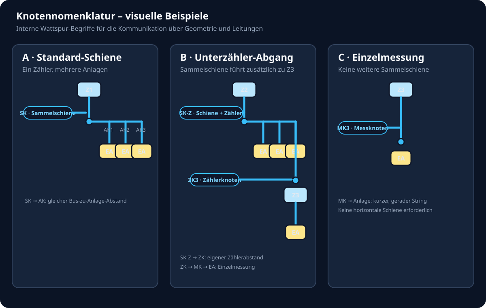

# Messkonzept-Geometrie – Spickzettel

Diese Übersicht beschreibt die Regeln, nach denen Wattspur die Messskizze zeichnet. Sie ist bewusst fachlich formuliert, damit Änderungen an der Darstellung nicht versehentlich die Topologie verändern.

## 1. Die drei Ebenen

| Element | Fachliche Bedeutung | Geometrische Aufgabe |
| --- | --- | --- |
| HAK | Netzanschlusspunkt und Eigentumsgrenze | Startpunkt des Hauptstrangs |
| Basiszähler (z. B. Z1/Z2 im gewählten Messkonzept) | Messstufe im Einzähler- oder Parallelmodus | Eigener vertikaler Strang; darunter kann eine Sammelschiene beginnen |
| Zusatz-Zähler (z. B. Z3/Z4/Z5) | Vorgeschalteter Zähler vor einer Anlage oder Anlagengruppe | Bei einer Gruppe eigener Rail-Knoten vor der Kartenreihe; bei nur einer Anlage zunächst inline am Zielobjekt |

## 2. Wann entsteht eine Sammelschiene?

1. Eine einzelne Anlage hinter einem Zähler wird direkt verbunden. Es gibt noch keinen zusätzlichen horizontalen Bus.
2. Sobald derselbe Zusatz-Zähler mindestens zwei Anlagen misst, wird er zum gemeinsamen Messpunkt der Gruppe.
3. Dann wird der Zusatz-Zähler aus dem ersten Anlagenast herausgelöst und als eigener Knoten vor der Anlagenreihe dargestellt.
4. Alle Anlagenkarten der Gruppe werden auf dieselbe Höhe gesetzt. Ihre Abgänge laufen vom horizontalen Bus senkrecht nach unten zu den Karten.

## 3. Verbindliche Knotennomenklatur

Ein Knotenpunkt ist bei uns kein beliebiger sichtbarer Linienknick, sondern ein
fachlich relevanter Anschlussanker. Wir verwenden künftig diese Bezeichnungen:

Die Kürzel sind interne Wattspur-Kommunikationsbegriffe. Sie ersetzen keine
offiziellen Bezeichnungen des Netzbetreibers oder der VBEW-Unterlagen.

| Kürzel | Verbindlicher Name | Bedeutung und Standardroute |
| --- | --- | --- |
| **HK** | **HAK-Abgangsknoten** | Der zentrale Punkt direkt unter dem HAK. Von hier führt der Hauptstrang senkrecht nach unten zum ersten Messpunkt bzw. zur ersten Sammelschiene. |
| **SK** | **Sammelschienenknoten** | Der Startpunkt einer horizontalen Sammelschiene auf der Achse des übergeordneten Zählers. Von hier laufen die Anlagenabgänge senkrecht nach unten. |
| **SK-Z** | **Sammelschienenknoten mit Zählerabgang** | Ein Sammelschienenknoten, der zusätzlich zu Anlagen auch zu einem weiteren Zähler führt. Die Zählerleitung beginnt am selben Knoten senkrecht nach unten; die Sammelschiene wird dadurch nicht seitlich verschoben. |
| **AK** | **Anlagenknoten** | Ein Abgangspunkt auf der Sammelschiene für eine Anlage. Der Anlagenstring läuft vom Bus senkrecht nach unten bis zur Oberkante des Anlagenobjekts. Alle AK derselben Schiene liegen auf derselben Bus-Höhe. |
| **ZK** | **Zählerknoten der Sammelschiene** | Ein Abgangspunkt auf einer Sammelschiene, an dem ein Zusatz-Zähler sitzt, der eine einzelne Anlage oder eine weitere Unter-Sammelschiene misst. Der String zum Zähler darf kürzer sein als ein Anlagenabgang, muss aber auf der Busachse sauber enden. |
| **MK** | **Messknoten am Zähler** | Der untere Anschluss eines Zählers. Bei einer Unter-Sammelschiene führt von MK zuerst ein definierter senkrechter Abstand nach unten, erst danach beginnt die nächste Sammelschiene. |

### Kommunikationsregel

Wir beschreiben künftig jede Leitung als gerichtete Verbindung zwischen zwei
Knoten. Beispiele:

```text
HK → SK(Z1)          Hauptstrang vom HAK zur ersten Schiene
SK → AK              Sammelschiene zu einer Anlage
SK-Z → ZK            Sammelschiene zu einem weiteren Zähler
ZK → MK              Zähleranschluss der Unterebene
MK → SK(Z3)          Zähler zur nächsten Sammelschiene
MK → Anlage          Einzelmessung ohne weitere Sammelschiene
```

Wichtig: `SK` und `SK-Z` sind geometrisch dieselbe Art von Busstart. `SK-Z`
kennzeichnet lediglich zusätzlich den Zählerabgang. `AK` und `ZK` dürfen nicht
verwechselt werden: Ein `AK` führt zu einer Anlage, ein `ZK` zu einem Zähler.

### Zuordnung im gezeigten Beispiel

- Der Punkt unter **Z1**, an dem die obere horizontale Schiene beginnt, ist
  `SK(Z1)`.
- Die Abgänge zu den oberen Erzeugungsanlagen sind `AK1` bis `AK6`.
- Der Punkt unter **Z2**, an dem die untere Schiene beginnt und die Leitung zu
  **Z3** abzweigt, ist `SK-Z(Z2)`.
- Der Abgangspunkt am rechten Ende dieser unteren Schiene zu **Z3** ist `ZK3`.
- Der Anschluss unter **Z3** zur einzelnen Erzeugungsanlage ist ein
  Einzelmessungsabgang `MK3 → Anlage`; hierfür darf der String kürzer sein als
  ein Anlagenabgang von `SK`.

Der Abstand `SK → AK` wird für alle Sammelschienen standardisiert. Die beiden
Zählerstrecken sind davon getrennt: `meterRailTopGapPx` beschreibt `SK-Z → ZK`
und `meterToSubBusGapPx` beschreibt `MK → SK`. So wird ein Zählerabgang nicht
versehentlich wie ein Anlagenabgang behandelt.

### Abstandsregeln für die Geometrie

Damit wir nicht nur Knoten, sondern auch die dazwischenliegenden Strecken
eindeutig besprechen können, verwenden wir diese Namen:

Ergänzung zur eindeutigen Benennung: `meterToJunctionLinkPx` ist der kurze
`MK → SK`-Abstand des Basiszählers bis zum ersten Sammelschienen-Knoten.
`meterToSubBusGapPx` bezeichnet dagegen den entsprechenden Abstand eines
Zusatz-Zählers bis zu seiner Unter-Sammelschiene. `meterRailTopGapPx` bleibt
der getrennte Abstand `SK-Z → ZK`.

Für den horizontalen Beginn der Anlagenreihe gilt eine gemeinsame Regel:
`primaryRailClearancePx` beschreibt den sichtbaren Abstand von der Messachse
bis zur ersten Anlagenkarte. Sie gilt für Root- und Unter-Sammelschienen
gleichermassen. Die Layoutmessung darf diesen Wert nur korrigieren, wenn die
gerenderte Karte sonst zu nah an der Achse liegt. Der sichtbare Löschbutton
eines Zählers wird mit `meterRemoveButtonClearancePx` nur bei einer echten
2D-Überlappung als zusätzlicher Sicherheitsabstand berücksichtigt.

| Strecke | Bedeutung | Ziel der Darstellung |
| --- | --- | --- |
| `HAK → SK` | Hauptstrang vom HAK-Abgangsknoten zur ersten Sammelschiene | Eine gerade senkrechte Achse ohne seitlichen Versatz |
| `SK → AK` | Anlagenabgang von der Sammelschiene zur Anlage | Einheitlicher Abstand für alle Anlagen derselben und aller gleichartigen Schienen |
| `SK-Z → ZK` | Abgang einer Sammelschiene zu einem weiteren Zähler | Eigenständiger Zählerabstand; nicht mit `SK → AK` gleichsetzen |
| `ZK → MK` | Anschluss durch den Zähler bis zu seinem unteren Anschluss | Kurzer, gerader Zählerstrang |
| `MK → SK` (Basiszähler) | Abstand vom Basiszähler bis zum ersten Sammelschienen-Knoten | Kurzer, zentraler Abstand; `meterToJunctionLinkPx` |
| `MK → SK` (Unterebene) | Abstand vom Zusatz-Zähler bis zur nächsten Unter-Sammelschiene | Einheitlicher Abstand; `meterToSubBusGapPx` |
| `MK → Anlage` | Einzelmessung ohne weitere Sammelschiene | Darf kürzer als `SK → AK` sein, bleibt aber senkrecht und endet direkt am Anlagenobjekt |

Für leere, bewusst erhaltene Unter-Rails gilt dieselbe Regel wie für gefüllte
Rails: Zähler und Sammelschienenknoten bleiben fachlich sichtbar, auch wenn
keine Anlage mehr angeschlossen ist. Für `SK-Z → ZK` gibt es keine Root-
Sonderregel mehr. Z1→Z2, Z2→Z3 und tiefere Ebenen verwenden denselben
vertikalen Sicherheitsabstand `meterRailTopGapPx`, derzeit 20 px. Der sichtbare
Sammelschienenknoten ist ein semantischer HTML-Anker; SVG zeichnet nur die
Leitungen und die übrigen nicht-interaktiven Geometrie-Markierungen.

Technisch bleibt ein solcher leerer Unterzähler anlagenbezogen (`meterScope: asset`).
`keepEmptyRail: true` hält ihn sichtbar und `railAnchorOrder` bewahrt den früheren
Anschlussplatz. Diese drei Informationen gehören zusammen. Wird der Zähler bewusst
auf ein anderes Ziel gezogen, dürfen sie neu gesetzt werden. Beim bloßen Löschen der
letzten Anlage dürfen sie nicht in eine normale Kaskadenstufe umgewandelt werden.

Die sichtbare Linie darf nur an einem dieser fachlichen Knoten beginnen oder
enden. Ein einzelnes Liniensegment ohne `HK`, `SK`, `AK`, `ZK` oder `MK` ist
immer ein Fehlerbild und kein zusätzlicher Knoten.

### Bildliche Beispiele

Die folgende Übersicht zeigt die drei wichtigsten Fälle auf einen Blick:



- **Beispiel A:** `SK → AK` – eine Sammelschiene verteilt auf mehrere Anlagen.
- **Beispiel B:** `SK-Z → ZK` – die Sammelschiene führt zusätzlich zu einem weiteren Zähler.
- **Beispiel C:** `MK → Anlage` – eine einzelne Anlage wird hinter dem Zähler gemessen, ohne dass eine weitere Sammelschiene entsteht.

## 4. Standardroute eines Zusatz-Zählers

```text
Elternbus / Elternzähler
          │
          │  senkrechter Zuleiter
         Zx  eigener Rail-Knoten
          │
          │  definierter Abstand
          ●  Sammelschienen-Knoten
          ├───────────────┬───────────────┐
          │               │               │
        Anlage         Anlage          Anlage
```

Wichtig: Der Bus darf nicht auf Höhe der Zählerkarte beginnen. Die Anlagenäste dürfen nicht nach oben zum Bus laufen. Die zentrale Konstante `meterToSubBusGapPx` definiert den kurzen Mindestabstand zwischen Zählerunterkante und Sammelschienen-Knoten. `meterRailTopGapPx` hält den Zusatz-Zähler selbst ausreichend weit von der oberen Anlagenreihe fern.

## 5. Zählerbaum statt Eingabereihenfolge

Die fachliche Zuordnung wird über `parentMeterId`, `meterId` und `targetAssetId` gebildet:

- `parentMeterId`: hinter welchem Zähler liegt ein Zusatz-Zähler?
- `meterId`: von welchem Zähler wird eine Anlage unmittelbar gemessen?
- `targetAssetId`: vor welcher Anlage wurde ein Zusatz-Zähler zuerst angelegt?

Die DOM-Reihenfolge und die SVG-Leitungen dürfen diese fachliche Hierarchie nicht überschreiben. Deshalb wird zuerst der Zählerbaum aufgebaut und erst danach werden Rails, Karten und Leitungen gezeichnet.

## 6. Prüfregeln bei jeder Änderung

- Z1/Z2/Z3/Z4 bleiben auf einer Messachse, wenn sie in Reihe liegen.
- Ein Rail beginnt immer unterhalb seines eigenen Zählers.
- Ein Rail-Knoten wird genau einmal gerendert.
- Bei zwei oder mehr Anlagen in einer Gruppe darf die erste Anlage keinen eingebetteten Zusatz-Zähler mehr anzeigen.
- Alle Karten derselben Sammelschiene teilen sich dieselbe Bus-Höhe.
- Eine neue Anlage erweitert die vorhandene Schiene; sie darf nicht in eine neue, ungewollte Zeile teleportieren.
- Die Regeln gelten identisch für den Einzähler- und Parallelmodus; nur der übergeordnete Strang unterscheidet sich.
- Ein neuer Zusatz-Zähler darf auf einen bestehenden Zusatz-Zähler gezogen werden. Das Modell speichert dann `parentMeterId` und bildet die Kette `Z2 → Z3 → Anlage`; der neue Zähler bleibt dabei als eigener Rail-Knoten sichtbar.
- Ein neuer Zusatz-Zähler darf auch direkt auf einen Basiszähler (`Z1`, `Z2` im Einzähler-Strang) gezogen werden. Das Modell speichert dafür `parentBaseMeterIndex`; daraus entsteht ein eigener Messknoten hinter dem Basiszähler, ohne den Basiszähler als Anlage zu behandeln.
- Die HAK-/Z1-Spalte hat keinen zusätzlichen unteren Außenabstand. Dadurch ist der Abstand Z1→Z2 genauso groß wie Z2→Z3 und Z3→Z4.
- Wenn ein innerer Zähler von einer Einzelmessung zu einer eigenen Sammelschiene erweitert wird, bleibt seine Zielachse am reservierten Platz der ursprünglichen Anlage. Reicht der neue Unter-Rail über den nächsten Eintrag hinaus, reserviert Wattspur automatisch zusätzlichen horizontalen Abstand (`railSiblingClearancePx`); die nachfolgenden Anlagen-/Zählerknoten rücken gemeinsam nach rechts. Dadurch darf eine Erweiterung von Z2 oder Z4 weder den Elternbus schneiden noch einen Zähler in eine andere Schiene verschieben.
- Ein Unter-Rail darf nie links von der Messachse seines direkten Elternzählers liegen. Wird bei der Rückrechnung des ersten Anlagenplatzes ein negativer Versatz berechnet, korrigiert Wattspur ihn ausschließlich nach rechts (`getRailAxisClampShift`). So bleibt auch der linke Randfall innerhalb des Messbereichs.
- Ein reservierter Anlagenplatz für einen vorgeschalteten Zähler zählt bei der Achsenberechnung als erste Zelle. Die unsichtbare Platzhalterkarte darf nicht übersprungen werden; sonst verschiebt sich die Sammelschiene beim Ausbau scheinbar nach links.
- Automatische Ausrichtung verwendet nur positive Korrekturen. Ist eine Reihe bereits ausreichend weit rechts, wird sie nicht zurückgeschoben. Das verhindert, dass die erste Anlage oder ein Unterzähler den Hauptstrang kreuzt.
- Ob ein Root-Rail ein Einzelast ist, wird am vollständigen Rail-Baum geprüft. Ein Unter-Rail innerhalb des Root-Rails zählt als Sammelschiene; eine Prüfung nur auf direkten Zonen-Kindern ist unzulässig, weil sie beim ersten Ausbau eines Parallel- oder Unterzweigs den Root-Strang falsch ausrichten kann.

## 7. Typische Fehlerbilder und Ursache

| Fehlerbild | Wahrscheinliche Ursache |
| --- | --- |
| Erste Anlage hängt noch senkrecht am Zusatz-Zähler | Zusatz-Zähler wird noch im Anlagenast statt als Rail-Knoten gerendert |
| Anlagenstrings laufen nach oben | Bus-Höhe liegt unterhalb der Kartenanker oder Karten haben unterschiedliche Oberkanten |
| Zähler teleportiert in die obere Schiene | Elternbeziehung fehlt oder `getDisplayParentMeterId()` wird nicht berücksichtigt |
| Neue Anlage erscheint unten links | Direkte Anlagen wurden nach Gruppen chronologisch statt fachlich sortiert |
| Starker Rechtsruck | Gruppenoffset wird von der gesamten oberen Reihe statt vom unmittelbaren Elternzähler berechnet |
| Unter-Rail springt links aus dem Messbereich | Negativer Rail-X-Versatz beim ersten/äußersten Gruppenplatz; Achsen-Clamp fehlt oder wurde nicht angewendet |
| Erste Anlage eines Parallelzweigs zieht den Strang nach links | Unter-Rail wurde wegen einer zu flachen DOM-Prüfung als Einzelast behandelt; Sammelschienenabstand wird dadurch übersprungen |

## 8. Änderungsstrategie

Bei einer Geometrieänderung zuerst klären, ob es sich um:

1. ein Datenmodell-/Zählerbaumproblem,
2. ein DOM-/Rail-Layoutproblem,
3. ein SVG-Routingproblem oder
4. ein reines CSS-Abstandsproblem

handelt. Erst danach die zuständige Datei ändern. Die fachliche Topologie bleibt in `messkonzept-topology.js`, wiederverwendbare Koordinatenregeln in `messkonzept-geometry.js`, und die konkrete Darstellung/Routing-Integration in `messkonzept.js`.

## 9. PDF-Export: Bühne und Leitungen gemeinsam halten

Der PDF-Export verwendet dieselbe bereits geroutete Skizze wie der Editor. Die
SVG-Leitungsebene wird nicht ein zweites Mal fachlich berechnet. Für den Druck
wird die komplette `.mk-canvas-stage` deshalb als unveränderte Kopie mit den
bereits ermittelten Breiten und Höhen übernommen.

Der Rahmen und sein Innenabstand liegen außerhalb der Bühne in
`.mk-print-canvas-frame`. Padding oder Zoom direkt auf `.mk-canvas-stage` ist
unzulässig, weil dadurch die HTML-Karten verschoben werden können, während die
absolut positionierte SVG-Leitungsebene am alten Ursprung bleibt. Der
Regressionstest `tests/pdf-wire-geometry-test.js` schützt diese Regel.

### 9.1 PDF-Ausgabevarianten

Die kompakte Ausgabe und der Gesamtexport nutzen dieselbe Skizzen-Snapshot-
Funktion. Der kompakte Export lässt nur die ausführlichen Objektdetails weg;
Projektangaben, Warnhinweis, Prüfstatus und Kommentar bleiben erhalten. Dadurch
ist die Skizze für eine schnelle Abstimmung weitergebbar, ohne dass für die
Kurzfassung eine zweite Leitungslogik gepflegt werden muss.
